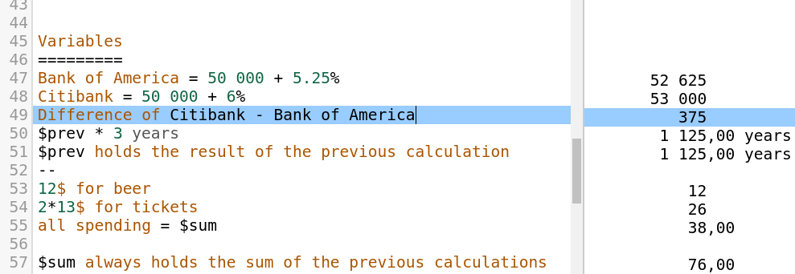

## NoteCalc

#### A handy calculator for the web.



You can try this app from here: http://bbodi.github.io/notecalc2

After cloning, the project can be built and tested with the following commands:
```
npm install
npm start
```
Then browse to http://localhost:3000/

Unit tests are skipped by default, they are exectued on http://localhost:3000/?test (results are on the console, if everything is fine, you will not see anything in the browser),

Building release version: 
``npm run build``
